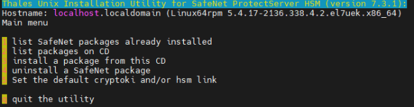
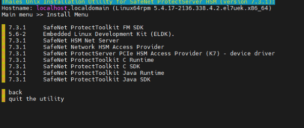
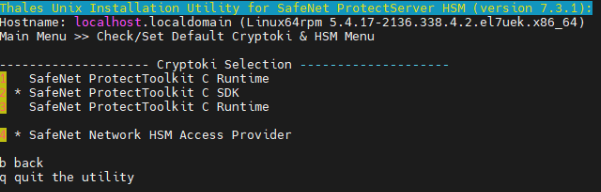
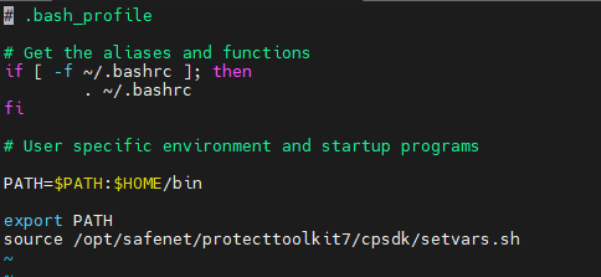
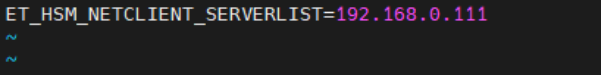
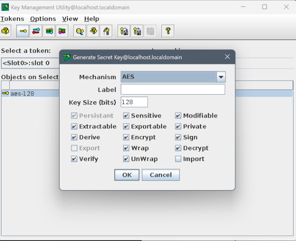

# PTK(Linux) 설치하기

## 1. PTK(tar) 파일 압축해제하기

```bash
tar -xvf 610-009981-032_SW_PTK_7.3.1_Client_RevA.tar
```

## 2. 디렉토리 이동

```bash
cd 610-009981-032_SW_PTK_7.3.1_Client_RevA/SDKs/Linux64/
```

## 3. PTK 설치파일 실행

```bash
[root@localhost Linux64]# ./safeNet-install.sh
```


Y를 눌러서 install 실행

→ 실행후 출력물



## 4. 설치할 프로그램들 확인 및 선택

3번을 눌러 설치할 프로그램들을 확인 및 선택



## 5. 프로그램 설치 순서

프로그램 다운로드 순서는 4번(HSM Access Provider), 6번, 7번, 8번, 9번 순서로 설치

## 6. 설치 완료 후 설정

설치 후 b를 눌러 뒤로 나오기


(뒤로 나온 후 화면)

## 7. Cryptoki Provider 설정

설정창 5번 선택 후 Cryptoki Provider 설정



> **중요 사항:**
> - PSE의 에뮬레이터 모드를 실행하려면 SDK를 디폴트로 설정해야 함
> - PSE 장비와 물리적으로 연결하기 위해서는 C Runtime을 디폴트로 설정해야 함

## 8. 환경변수 설정

```bash
vi ~/.bash_profile
```

`source /opt/safenet/protecttoolkit7/cpsdk/setvars.sh` 입력 후 저장



## 9. 장비에 물리적으로 연결할 경우

### 9.1 디렉토리 이동
```bash
cd /etc/default
```


### 9.2 PSE IP 설정
```bash
vi et_hsm
```
PSE에 설정된 IP 값 입력



## 10. 설치 확인

### 10.1 ctconf 명령어 확인
```bash
ctconf -v
```
정상적으로 호출되는지 확인


### 10.2 슬롯 초기화
```bash
gctadmin
```
입력 후 slot initializing 진행


### 10.3 슬롯 초기화 명령어
```bash
ctkmu t -s<슬롯넘버> -l<label>
```


**이니셜라이징 하기 전 ctkmu l 명령어로 기존 오브젝트들을 조회한 결과**


**ctkmu t -s<슬롯넘버> -l<label> 명령어로 이니셜라이징 후 ctkmu l로 슬롯 오브젝트를 조회한 결과**

## 11. 오브젝트(키) 생성

### 11.1 키 생성 (kmu)



### 11.2 키 생성 (ctkmu c)

```bash
ctkmu c -t <key_type> -n <label> -a <attribute> -s<슬롯지정>
```

**매개변수 설명:**
- `-t`: **키 타입 지정** (필수)
- `-n`: **키 이름(label)** → 이걸로 나중에 찾을 수 있음
  - 예: `-n myAESKey`
- `-a`: **속성(attributes)** → 키 권한을 정함
  - E (Encrypt), D (Decrypt), S (Sign), V (Verify)
  - W (Wrap), U (Unwrap), R (Derive), M (Modifiable) 등
  - 예: `-a ED` → Encrypt/Decrypt 가능 키
- `-s`: 특정 슬롯 지정 (여러 슬롯 있는 경우)


## 12. 오브젝트(키) 조회하기

### 12.1 오브젝트 조회 (ctkmu l)

```bash
ctkmu l -s<슬롯지정>
```


### 12.2 오브젝트 조회 (kmu)


**슬롯 지정하여 유저핀으로 로그인 후 화면**
